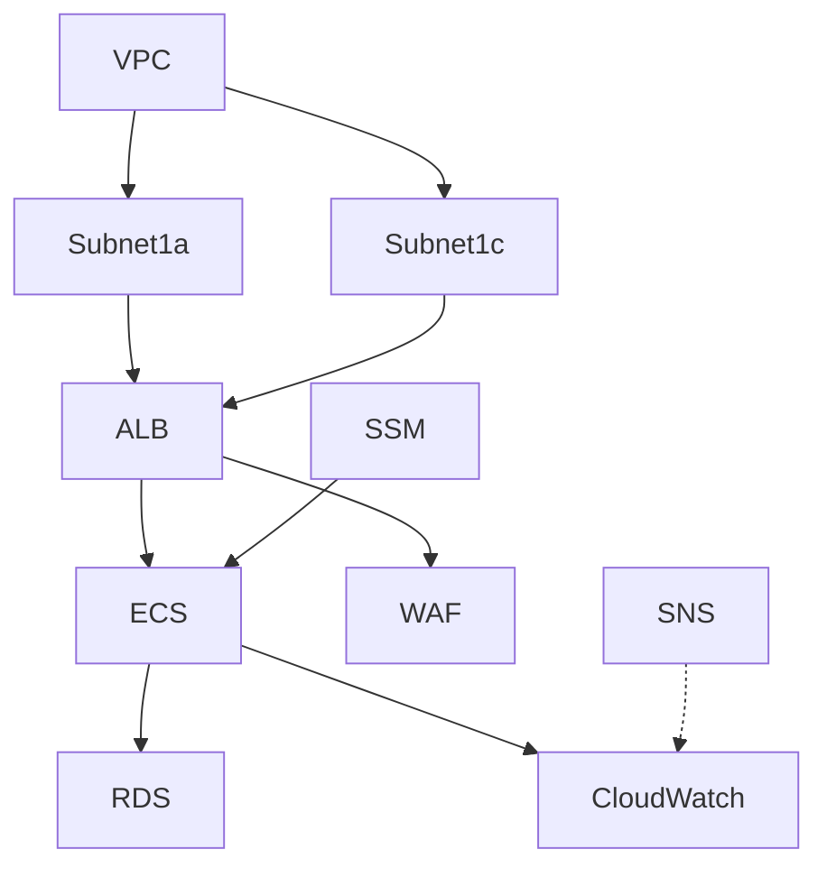

# Portfolio-2: AWS 本番レベルインフラ構築

## 概要
本リポジトリは AWS を活用した本番レベルのインフラ構成を Terraform により完全コード化したポートフォリオである。  
モジュール化、環境分離（dev/prod）、S3 + DynamoDB による state 管理、CI/CD 自動化までを網羅。

## 使用技術スタック
- AWS
  - VPC / Subnet / IGW / NAT / RouteTable
  - ALB / ECS(Fargate) / RDS(MySQL)
  - IAM / WAF / CloudWatch / SNS
- Terraform >= 1.6.0
- GitHub Actions (CI/CD)
- GitHub (バージョン管理)

## 構成理由
- **IaC による管理**: 再現性・保守性・レビュー性向上
- **モジュール化**: VPC / ALB / ECS / RDS など機能単位に分割
- **環境分離**: dev / prod 環境ディレクトリ分離
- **Backend 構成**: S3 + DynamoDB による remote state 管理と lock 機構
- **CI/CD**: GitHub Actions による terraform fmt / plan 自動実行

## .gitignore 設計
- `*.tfstate`
- `*.tfstate.*`
- `.terraform/`
- `crash.log`
- `terraform.tfvars`
- `override.tf`
- `override.tf.json`
- `*_override.tf`
- `*_override.tf.json`
- `.terraform.lock.hcl`

state ファイルやキャッシュは S3 Backend で管理し Git に含めない。

## 使用
- `infra/` 配下に Terraform モジュールと環境構成
  - `infra/modules`: 各種モジュール
  - `infra/dev`: 開発環境
  - `infra/prod`: 本番環境

## アーキテクチャ図


## ブランチ戦略
- `main`: 本番ブランチ
- `dev`: 開発ブランチ
- PR ベースのワークフローを採用

## 利用方法
```bash
# 初期化
terraform init

# フォーマット確認
terraform fmt -check

# plan 実行
terraform plan

# 適用
terraform apply
```

各環境 (`infra/dev`, `infra/prod`) ごとに実行。

## 備考
- **CI/CD**: GitHub Actions による fmt / plan チェックワークフローを実装済み。
- **Backend**: `hasegawa-terraform-state` S3 バケット、`terraform-lock` DynamoDB テーブルを backend に使用。
- **セキュリティ**: IAM 最小権限設計、セキュリティグループを適切に設定。
