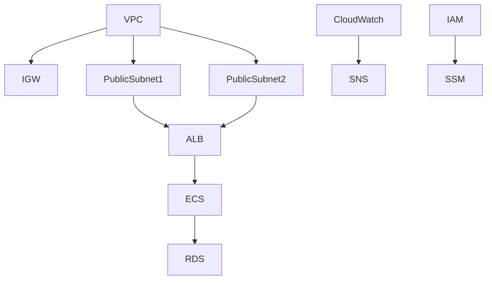

# Portfolio-2: AWS本番レベルインフラ構成

このリポジトリは、Terraform を用いて本番レベルの AWS インフラをコード化（IaC）したもの。

---

## ✅ 概要

以下の AWS リソースを含むインフラ構成：

- VPC / サブネット / インターネットゲートウェイ / NAT / ルートテーブル
- Application Load Balancer (ALB)
- ECS (Fargate) + Nginx
- RDS (MySQL)
- IAM ロール
- CloudWatch / SNS による監視
- SSM Session Manager による管理
- Terraform バックエンド（S3 + DynamoDB Lock）
- `dev` と `prod` 環境分離

---

## ✅ アーキテクチャ図



---

## ✅ 前提条件

- Terraform バージョン >= 1.6.0
- AWS CLI がセットアップ済み (`aws configure`)
- AWS アカウントと必要な権限

---

## ✅ 利用方法

### 環境初期化（dev / prod 各ディレクトリで実行）
```
cd infra/dev    # または cd infra/prod
terraform init
```

### コードフォーマット確認
```
terraform fmt -check
```

### Plan 実行
```
terraform plan
```

### Apply 実行
```
terraform apply
```

---

## ✅ ブランチ戦略

- `main` : 本番環境用インフラコード
- `dev` : 開発環境用インフラコード
- `dev` で動作確認後、Pull Request によって `main` にマージ

---

## ✅ .gitignore 設計

以下のファイルを `.gitignore` に追加し、機密情報や状態ファイルを管理から除外：

```
*.tfstate
*.tfstate.*
.terraform/
crash.log
terraform.tfvars
override.tf
override.tf.json
*_override.tf
*_override.tf.json
.terraform.lock.hcl
```

---

## ✅ 備考

- **Terraform バックエンド**  
  - S3 バケット: `hasegawa-terraform-state`
  - DynamoDB テーブル: `terraform-lock`

- **AWS リージョン**  
  - `ap-northeast-1`（東京リージョン）

